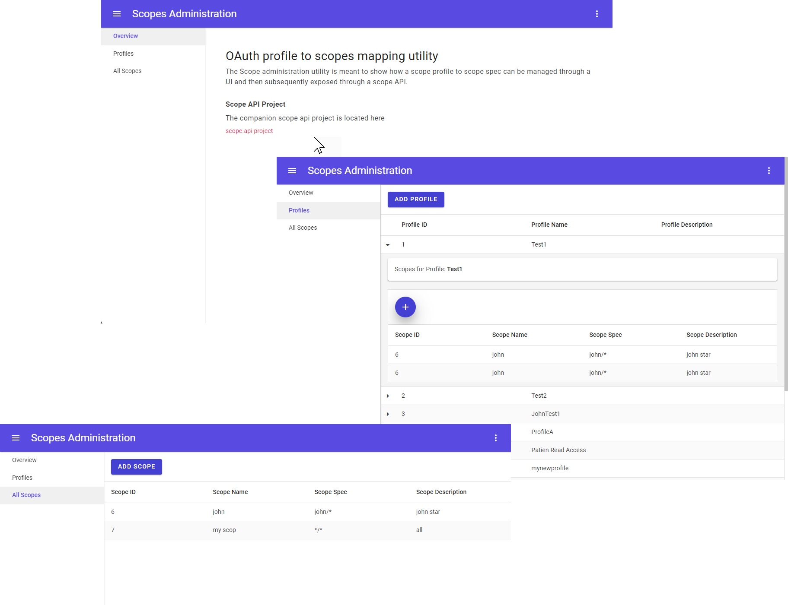

# Scopes.UI

## Overview

A quick prototype of what a Profile to Scopes UI mapping and management site might look like.

**This is a POC**

## What it looks like


## Technologies

- Blazor (for UI)
- .NET Core
- [RadZen Components (free opensource blazor components)](https://blazor.radzen.com/)
- [MudBlazor Components (free opensource blazor components)](https://mudblazor.com/)
- Database (Current Postgres)
    - Can use either local install or docker
    - Postgres docker
        ```
        docker pull postgres

        docker run -it -p 5432:5432 --name postgres-apiscopes -e POSTGRES_PASSWORD=mypassword -d postgres
        ```

## Database

There is a database.sql file located in the root of the project. You can use this to create your own database. This is required for the UI project. Currently this proof of concept uses a Postgres database (see above)

## Getting Started

### Configuring database

Run the commands in the database.sql file individually to create the database and tables needed for the project.

### Setting environment variable

The project is docker friendly so we use the environment variable configuration provider to make it easier when starting the project in a container. 

Set the following environment variables with the connection string for the database. Use your favorite CLI to set the environment variable

| Name | Description |
| ---- | ----------- |
| $env:POCSCOPES_connectionstrings__db | Connection string |


### Powershell Example

```
$env:POCSCOPES_connectionstrings__db = "Host=localhost;port=5432;Database=APISCOPES;username=postgres;password=password"
```